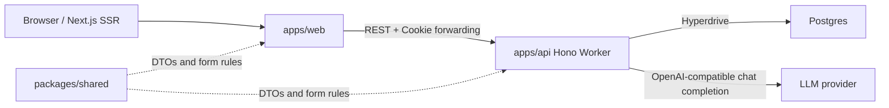

# Domain Documentation

Last scanned: 2026-05-14

This directory records domain knowledge inferred from the current codebase. It is intentionally implementation-grounded: when it differs from older planning documents under `docs/orchestration/`, treat this directory as a snapshot of what the app currently does.

## Product Summary

Tsukeai is an SNS-style public timeline where users submit private free-form text, the backend converts that text into a Japanese tanka-shaped public text through an LLM, and only the transformed public text is stored and shown.

The domain boundary is privacy-first:

- Raw user post/reply input is accepted by the API only as request data.
- Raw input is hashed for idempotency and observation.
- Public records contain only transformed tanka text plus ownership and thread metadata.
- LLM prompts, raw input, provider response bodies, and provider error bodies are not part of public DTOs.

## Main Concepts

| Concept | Meaning in code | Main source |
|---|---|---|
| Account | Author identity used for writes, ownership, and self-delete checks. | `accounts` table, session cookie verification |
| Thread | Conversation container. Each root post creates one thread. Replies belong to the parent post's thread. | `threads` table |
| Public conversion | The stored, publishable text. `kind = post` for 5-7-5 roots and `kind = reply` for 7-7 replies. | `public_conversions` table |
| Transform job | Durable conversion attempt created from raw input hash and idempotency key. | `transform_jobs` table |
| Form check | Shared validation for accepted tanka shape, separators, kana-only text, and mora counts. | `packages/shared/src/index.ts` |
| Timeline | Public read model composed from published root conversions and their published replies. | `GET /api/timeline` |

## Runtime Shape

## Document Map

- [Data Model](./data-model.md): database entities, ownership, deletion, and persistence rules.
- [API Surface](./api-surface.md): routes, request/response behavior, auth, and status semantics.
- [Transform Pipeline](./transform-pipeline.md): job lifecycle, LLM prompting, validation, retry, and failure classification.
- [Frontend Domain](./frontend-domain.md): current Next.js user-facing flows and UI assumptions.
- [Implementation Gaps](./implementation-gaps.md): domain gaps and differences between current code and intended behavior.

