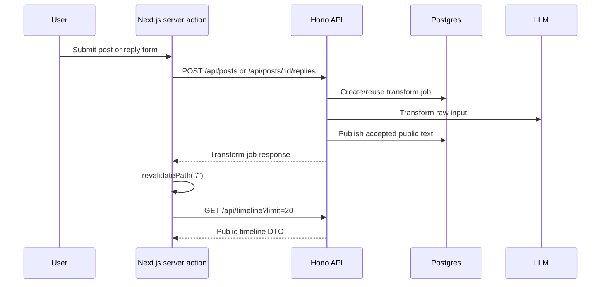

# Frontend Domain

Last scanned: 2026-05-14

## Current User Experience

The web app is a Next.js App Router page at `/`. It renders a server-side public timeline and simple forms for creating posts, replying, and deleting public conversions.

Visible language is Japanese:

- Page title: `公開タイムライン`
- Lead text: `変換済みの公開句だけをサーバーで取得して表示します。`
- Post form placeholder: `五七五に変換したい内容`
- Reply form placeholder: `七七に変換したい内容`

## Data Flow

The web server forwards the incoming `Cookie` header to the API for authenticated writes. It always sets `Accept: application/json`.

## Timeline Rendering

The page fetches `GET /api/timeline?limit=20` with `cache: "no-store"`.

It maps the API response into a local public model:

- `post.id`
- `post.author`
- `post.publicText`
- `post.createdAt`
- `reply.id`
- `reply.postId`
- `reply.author`
- `reply.publicText`
- `reply.createdAt`

The mapper accepts either `publicText` or `body`, but current API DTOs return `body`.

When the timeline cannot be loaded, the page shows `タイムラインを読み込めませんでした。`

When no items exist, it shows `まだ公開句はありません。`

## Write Forms

Root post form:

- Server action: `createPost`.
- API path: `/api/posts`.
- Transform kind: `post_575`.
- Submitted field: `body`.
- Idempotency key: fresh `crypto.randomUUID()` per submission.

Reply form:

- Server action: `createReply(postId, formData)`.
- API path: `/api/posts/:postId/replies`.
- Transform kind: `reply_77`.
- Submitted field: `body`.
- Idempotency key: fresh `crypto.randomUUID()` per submission.

Delete form:

- Server action: `deletePublicConversion(publicConversionId)`.
- API path: `/api/public-conversions/:id`.

After each successful write/delete, the page revalidates `/`.

## Smoke Mode

When the web process has `WRITE_SMOKE_FIXED_PUBLIC_TEXT=1`, the forms send fixed valid public text instead of raw input:

- Post: `あさひさす\nこころしずかに\nはるをまつ`
- Reply: `ほしをかぞえて\nよるがあけゆく`

This mode is paired with the API's smoke-only public text write path and lets tests exercise write flows without an LLM provider.

## Current UX Limits

The current page assumes the create request completes or throws during the server action. It does not yet provide a visible pending transform job state, polling UI, or per-form error display for `202`, `422`, `429`, or `503` transform outcomes.

The delete button is rendered for every timeline item visible to the current page, even though the API allows deletion only by the author. Unauthorized delete attempts fail server-side.

