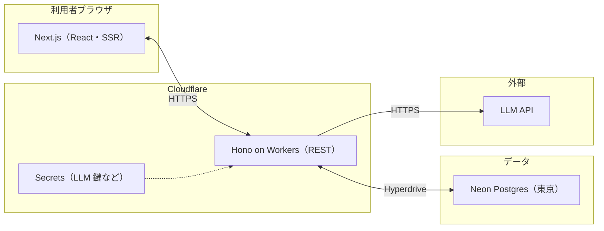

# Design Artifact

## Source Scope

`scope.md` / `scope.coverage.json` を唯一の上位境界とする。MVP の Must（長文→5-7-5 のみ公開、GT、対称型返信の変換のみ公開、形式検証、最小識別、**M6 本人削除**）と Deferred／Rejected を前提に、実装に先立つ方式・境界のみを記載する。

**Design 対話の確認**: ユーザーは **本人による公開句の削除を MVP に含める**と回答した。**`scope.md` は M6 として追記済み**（Scope amendment note 参照）で、Source Scope と整合する。

**Design で確定した認証の要点（ユーザー回答の要約）**: GT は **未ログインでも読める**。投稿・返信は **ログイン必須**。通報・管理者削除は **MVP に含めない**。

## Architecture Policy

**公開インターネット向け Web**。利用は **数十人の実験**を想定し、**計画的停止・短時間のダウンは許容**する。 **LLM 以外の固定費は極力抑え**、可能なら無料枠を活用する。**東京リージョンを優先**し、国内からの利用体感をよくする。

**プレゼンテーション**は **Next.js（App Router）＋ React** とし、**SSR を前提**に GT・投稿・返信 UI を扱う。**公開 REST と変換・認可・外部連携**は **Hono を Cloudflare Workers 上に載せたサービス**に置く。

**永続の正本**は **Neon の Postgres（東京）** とし、Workers から **Hyperdrive** 経由で接続する。**API は REST（JSON）** とする。**LLM 鍵と変換パイプラインは Workers のみ**。**長文・返信素はパイプラインに必要な間のみ保持し、成功後は削除またはハッシュ等に寄せる**。

## Core Concepts

- **Account**: 最小識別。書き込み・削除主体。
- **TransformedPost**: 公開 5-7-5。素の長文は公開しない。
- **TransformedReply**: 公開 7-7。返信素は公開しない。
- **Thread**: 親子関係。GT でたどれる単位。
- **FormCheck**: 受理／却下（文学品質のスコアリングは別レイヤー）。

## Storage Model

**Postgres（Neon）に載せるもの（方針）**: アカウント識別子、**公開変換句**とメタデータ、スレッド関係、**検証結果・公開可否**に必要な最小列。**GT 閲覧**は時系列・ID で成立させる。

**載せない／短期のみ**: 長文・返信素は **長期のドメイン資産としては保持しない**。障害調査のため **短時間バッファやハッシュのみ**を許容する。**ログに素的全文を残さない**ことを原則とする。

## Integration Boundaries

ユーザーは対話で **REST（JSON）** を既定とし、**Next に API を閉じ込めず Hono と分割する**ことに納得している（「RESTでよさそう」「Hono Nextスタックでいい気もします」等）。**Neon は OK** と明示された。

- **ブラウザ ↔ API**: **HTTPS の REST（JSON）**。Next と Hono の URL 関係（同一オリジンに見せるか分割か）は実装で選択するが、**Cookie・CORS は設計上の境界**とする。
- **Workers ↔ Neon**: **Hyperdrive**。整合が要る状態更新は **トランザクション**を設計目標とする。
- **Workers ↔ LLM**: **サーバからのみ**。インジェクション緩和はサーバ側の責務。
- **共有型**: **`packages/shared`** で契約を共有し、フロントは **DB スキーマに直接依存しない**。

## Authentication and Authorization (MVP)

- **GT の閲覧**: **未ログインでも読める**（ユーザー確認済み）。
- **投稿・返信**: **ログイン必須**（ユーザー確認済み）。
- **本人削除**: **自分の投稿・返信（変換後の公開句）を削除できる**ことを MVP に含める（ユーザー確認済み）。**Scope の M6** と一致する。
- **通報・管理者削除**: **MVP には含めない**（ユーザー確認済み）。リスクとして Design で認識し、後続で検討。
- **セキュリティ志向（料金不要の範囲）**: **SMS のような従量前提に依存しない**前提で、**WebAuthn／パスキーまたは TOTP 等の 2FA クラス**を志向する（ユーザー発言に基づく）。**パスワードのみ／パスキーのみ／併用などの組み合わせは、実装作業に着手する前に確定**する。Design は **志向と境界**までとし、**ベンダー固定や詳細フローは書かない**。

## llm-task-orchestrator Boundary

製品境界と方式は **本リポジトリおよび solo-dev-orchestrator の成果物**が正本とする。**実装・検証・レビューの実行**は **llm-task-orchestrator** が **タスク定義に基づき行う**。下流の YAML 生成は Plan Export の責務であり、Design では **具体的なタスク記述を書かない**。

## Operational Boundaries

- **秘密情報**: LLM 鍵は **Workers Secrets**。クライアントに置かない。
- **入口**: **アカウント／セッション単位**で投稿・変換・LLM に **上限の考え方**を置く。
- **ログ**: **素的全文をログに残さない**。短時間バッファ／ハッシュのみを許容。
- **障害時**: 変換が止まる場合は **新規公開フローを止め**、**既存の公開句の閲覧は可能なら維持**。**検証に落ちたものは公開しない**。
- **コスト**: **キュー・上限・バックオフ**。キャッシュは **プライバシーと整合する範囲**のみ検討。

## Design Risks and Assumptions

- **GT のモデレーション表面積**（通報は MVP 外でも閲覧リスクは残る）。
- **形式検証と生成品質**の両立。
- **プロンプトインジェクション**等。
- **リクエスト集中時のコスト**。
- **サードパーティ LLM 依存**。
- **ソロ運用**と可用性のトレードオフ。
- **高セキュリティ志向と実装コスト**（パスキー／2FA の採用範囲）。

## Repository Layout (MVP)

**pnpm workspaces ＋ Turborepo** を既定とする。**モノレポ**で Web と API の依存を一方向に固定する。

- **`apps/web`**: Next.js。
- **`apps/api`**（または同等の名前）: **Hono on Workers**。
- **`packages/shared`**: 共有型・REST 契約スキーマ。

## CI/CD Policy (MVP)

- **変更の取り込み前に** Lint・型・自動テストを通す方針とする（ホストはリポジトリの場所に依存しない）。
- **本番シークレットはリポジトリに置かない**。
- **素的データを CI ログに残さない**よう注意する。
- **デプロイ**は Web と Workers API が **別パイプラインになりうる**ことを許容する。

## Testing Strategy (MVP)

- **Lint／Format**: **Biome を単一ツールとして既定**とする（ユーザー選択 ①）。
- **単体・契約**: **Vitest** 等と **共有スキーマ**で REST 境界を検証できるようにする。
- **FormCheck**: LLM を介さない単体検証を優先。
- **LLM**: CI は **実呼び出しに依存しない**（モック／録画）。
- **E2E**: **Playwright**。**クリティカルパスはスモークに限定**する方針。
- **VRT**: **Playwright のスクリーンショット比較を最小限**試す（ユーザー確認済み）。

## Do Not Cross

本 artifact は **方式・境界・ポリシー**までとする。**実装作業の列挙・順序・工数・個別ファイルの編集指示**は書かない。Plan／llm-task-orchestrator の領域。**具体的なインフラ設定値・DDL・ワークフロー定義の全文**もここでは書かない。

## Ready for Plan

分割（Next／Hono／Neon／REST）、データとログ、認証認可、モノレポと CI／テスト方針が揃った。次フェーズ Plan で **実装可能な粒度のタスク候補**へ分解する。

## Artifact Output Permission

ユーザーは Final Coverage Review 後に「OK」と回答し、`design.md` / `design.coverage.json` の生成・提出を許可した。
